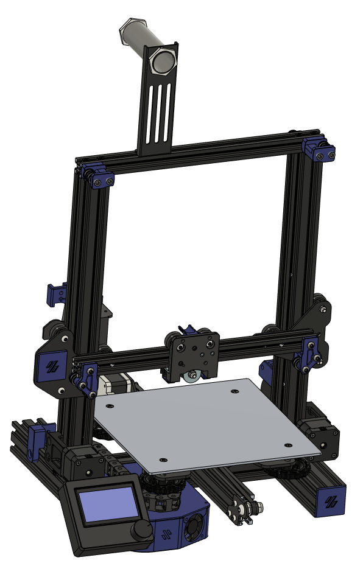

# BudgetWire
Heavily based off of Gizzle's EnderWire: https://github.com/VoronDesign/VoronUsers/tree/master/printer_mods/Gizzle/ender-3_(pro)_switchwire

## General Information

  - Go to Gizzle's mod that is linked and read through it
  - X extrusion will NEED to be cut a bit (~20mm)
  - Do at your own risk only ~60hrs printed on it so far with no issues but still in beta
  - No BOM available yet (uses screws I had laying around and I cut alot of them)
  - Feel free to make changes and create a PR to help this project develop more as I do not plan on actively developing it
